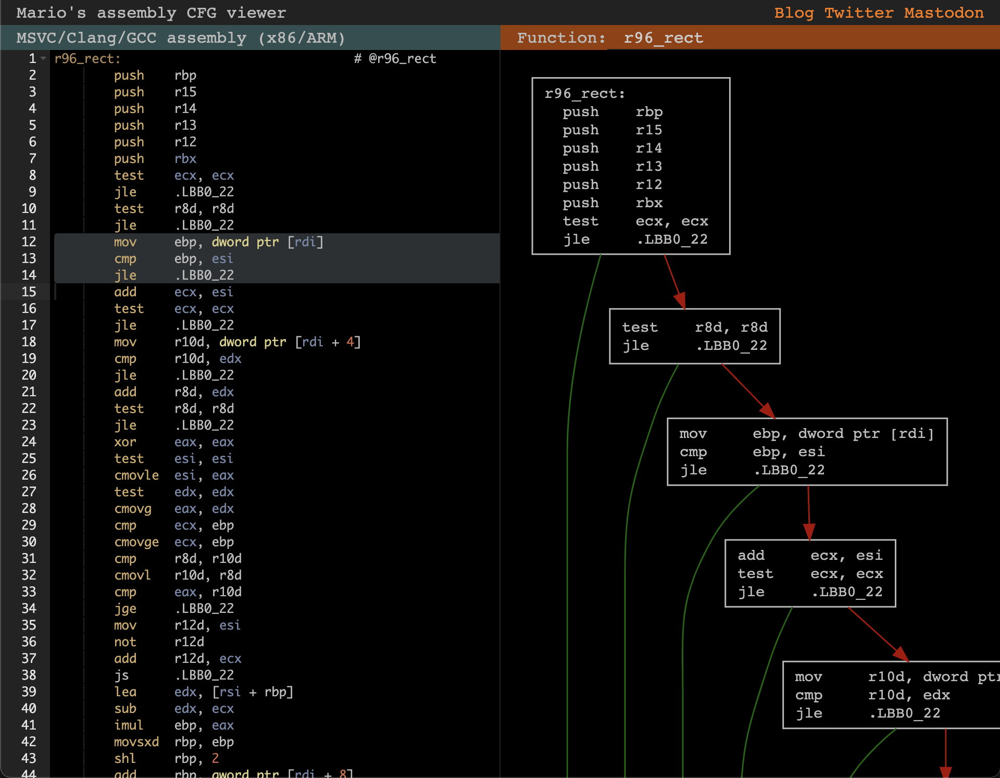

# asmcfg

An assembly control flow graph/basic block visualizer for the web.

## What does it do?
`asmcfg` takes assembly code generated by MSVC, Clang, or GCC and creates a control flow graph for each function.

The control flow graph can then be rendered to either a [Graphviz dot string](https://graphviz.org/doc/info/lang.html), or to an SVG element in the browser.

The SVG element can be made pan- and zoomable. Clicking a node in the graph can also trigger a callback which can then e.g. highlight the corresponding lines in a code editor.

Check out the (almost) production ready app [Mario's Assembly CFG viewer](https://marioslab.io/projects/cfg/), or run the example in this repository via `npm install && npm run dev && open http://localhost:8080/example`.

## Installation
You can integrate `asmcfg` into your web app as an `IIFE` "module":

```
<script src="https://cdn.jsdelivr.net/npm/@marioslab/asmcfg@latest/dist/iife/asmcfg.min.js"></script>
```

All classes and functions will then be available through the global `asmcfg` object.

Alternatively, you can add `asmcfg` to your project via NPM or Yarn.

```
npm install @marioslab/asmcfg
```

Then import what you need from the module, e.g.:

```
import * as asmcfg from "@marioslab/asmcfg"
```

## Usage

```html
<svg>
    <g/>
</svg>
<script>
const assemblyCode = `
test:                                   # @test
        push    rbp
        mov     rbp, rsp
        sub     rsp, 16
        mov     dword ptr [rbp - 4], edi
        mov     dword ptr [rbp - 8], 0
.LBB0_1:                                # =>This Inner Loop Header: Depth=1
        mov     eax, dword ptr [rbp - 8]
        cmp     eax, dword ptr [rbp - 4]
        jge     .LBB0_4
        mov     esi, dword ptr [rbp - 4]
        lea     rdi, [rip + .L.str]
        mov     al, 0
        call    printf@PLT
        mov     eax, dword ptr [rbp - 8]
        add     eax, 1
        mov     dword ptr [rbp - 8], eax
        jmp     .LBB0_1
.LBB0_4:
        add     rsp, 16
        pop     rbp
        ret
`;

// Parse and generate a control flow graph (CFG) for each function.
let functions = asmcfg.parse(assemblyCode);

// Render the first function's CFG as a Graphviz dot format string
let dot = asmcfg.renderDot(functions[0]);

// Render the first function's CFG to a graphlib graph.
// Note: renderGraphlib() returns a Promise<dagreD3.graphlib.Graph>.
let graph = await asmcfg.renderGraphlib(functions[0]);

// Render the first function's CFG to an SVG element in the DOM
// Note: renderSvg() returns a Promise<SVGElement>.
// Note: the SVGElement must have an <g> child element.
let svg = await asmcfg.renderSvg(functions[0], document.querySelector("svg"));

// Make the SVG pan- and zoomable via mouse and touch. Set a callback for when a node in the graph is clicked.
asmcfg.makeInteractive(svg, functions[0], (lineStart, lineEnd, node, function) => {
    // Replace alert() with highlighting lines in the assembly code editor next to the SVG :)
    let message = `Clicked node of ${func.name}, lines ${lineStart}-${lineEnd}\n\n${node.lines.join("\n")}`;
    alert(message);
});
</script>
```

## Styling SVG nodes and edges
The generated SVG assigns CSS classes to nodes and edges, which can be styled:

```css
/* Style node contents */
.node {
    white-space: nowrap;
    font-family: Courier;
    cursor: pointer;
}

/* Style node bounding rectangles */
.node rect {
    stroke: #333;
    fill: #fff;
    stroke-width: 1.5px;
}

/* Style edges */
.edgePath path.path {
    stroke: #333;
    stroke-width: 1.5px;
    fill: none;
}

/* Style the edge arrow heads */
.arrowhead {
    stroke: blue;
    fill: blue;
    stroke-width: 1.5px;
}
```

`asmcfg` uses [dagre-d3](https://github.com/dagrejs/dagre-d3) under the hood, which in turn uses [`graphlib`](https://github.com/dagrejs/graphlib) and [d3](https://d3js.org/). If you need more customization, like [dagre-d3 style attributes](https://dagrejs.github.io/project/dagre-d3/latest/demo/style-attrs.html), you can modify the nodes and edges returned by `asmcfg.renderGraphlib()`, then call `asmcfg.renderSvgFromGraphlib()` to generate an SVG. This is illustrated in the example in this repository.

## Example
For a complete example, see [example/index.html](example/index.html). You can run the example via:

```
npm install
npm run dev
```

Then open [http://localhost:8080/example](http://localhost:8080/example) in your browser.

## Supported assembly code formats and ISAs
`asmcfg` has been tested with output from MSVC, GCC, and Clang for x86_64 and ARM64.

The graph building code is ISA agnostic for the most part, and will likely work with other ISAs out of the box.

The only ISA specific code is in [`isUnconditionalJump()`](src/parser.ts), It checks if a line contains an ISA specific unconditional jump. To add support for more ISAs, you should add the unconditional jump mnemonics for that ISA.

`asmcfg` is also pretty lenient concerning the assembly code format. The [parsers](src/parser.ts) try to identify function boundaries first. Then, the labels within each function are identified. Adding support for a different assembly code format requires applying a heuristic to identify which format the code is in in `parse()`, and then implementing a new `parseMyFormat()` function that returns the set of functions and their labels. See the existing parsers for an example.

## Bundle size considerations
Since `asmcfg` depends on `dagre-d3`, `graphlib`, and `d3`, the bundle size of `asmcfg.min.js` comes out a bit on the fat side with 510kb minimized. However, gzipped we get 164kb, which is acceptable. If you know of a lighter-weight, zero-dependency graph layouting library, let me know.

## Will you add feature X?
Unlikely, unless I have a need for it myself, or it's a neat idea.
